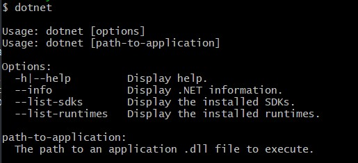

# C# Workshop

## Welcome! :octocat:


Today we will cover the basics of C#, you don't need to have any experience because this workshop is beginner friendly.
C# is pronounced "C-Sharp".

It is an object-oriented programming language created by Microsoft that runs on the .NET Framework.

C# has roots from the _C_ family, and the language is close to other popular languages like C++ and Java.
Hope you will learn something new today , wish you good luck 👍

## Set up

First of all you have to install editor which you can download from this link <a href="https://visualstudio.microsoft.com/vs/community/"> Visual studio code</a>.
Furthermore you'll need to install <a href="https://dotnet.microsoft.com/download"> .Net</a> which is a free, cross-platform, open source developer platform for building many different types of applications.If you successfully installed , type in your terminal `dotnet` to see if it runs correctly.
Output should be like this:
<br></br>

##
Once you have installed Visual Studio code on the left panel you'll see `extensions icon` press it and search for `C#` extension from Microsoft, install it.
Also you can download <a href="https://visualstudio.microsoft.com/downloads/"> Visual studio 2019</a> which is great IDE for not only `C#` but for many others programming languages.
If you want to work with Visual studio 2019 follow steps from this link <a href="https://docs.microsoft.com/en-us/visualstudio/get-started/csharp/tutorial-console?view=vs-2019">create console app</a>.
<br></br>
_Are you done yet installing ? If so , let's try to code something!_
##


## Try it yourself

```
Create new folder and open it in Vscode, you can name it how you want,
Open Terminal in Vscode and type dotnet new console
```

You'll see that new folder appears in your workplace named `obj`.
Type in the terminal `dotnet run` to run the code from new folder.
In the terminal you'll see `Hello World!`

**Congratulations you just ran your first C# line of code!**


## Variables!
Variables are the bread and butter of every programming language. They keep everything well organized  and straight. Variables are containers which allow a program to store different pieces of information inside of them. Once the information is stored inside the variable, that information can then be accessed throughout the program simply by referring to the variable's name.
Look at situation where you will need to use variables:
<br>
<ul style="list-style-type:none;">
  <li>Console.WriteLine("There once was a girl named Karen");</li>
  <li>Console.WriteLine("She was 10 years old");</li>
  <li>Console.WriteLine("She really didn't liked the name Karen");</li>
</ul>  
`Console.WriteLine("There once was a girl named Karen");
Console.WriteLine("She was 10 years old");
Console.WriteLine("She really didn't liked the name Karen");
Console.WriteLine("But she was enjoying being 10");`
<br>
Now a small `challenge` for you: add varibales to the story. Remember that variables are basically containers where we can store information like character's age and name.So your task is create variables for name and age and implement it in our code. Good luck !
**Ready? Share your solution with the rest
<br>

## Guessing game !
Open file `guessNumber.cs` (you will see it in the top of this repo) and copy paste code in your VScode, you will see some comments there , try to finish the game and share your result with the rest! Good luck :muscle:

## Challenge

### Useful resources
