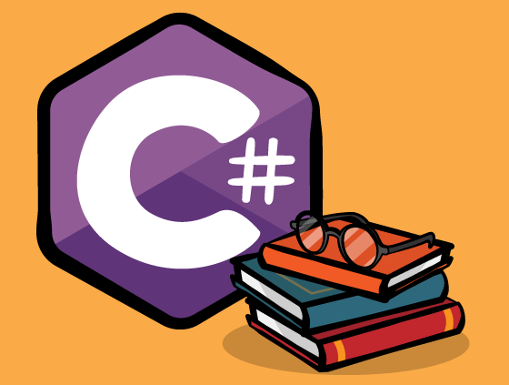

# C# Workshop

## Welcome! :octocat:



Today we will cover the basics of C#, you don't need to have any experience because this workshop is beginner friendly.
C# is pronounced "C-Sharp".

It is an object-oriented programming language created by Microsoft that runs on the .NET Framework.

C# has roots from the _C_ family, and the language is close to other popular languages like C++ and Java.
Hope you will learn something new today , wish you good luck 👍

## Set up

First of all you have to install editor which you can download from this link <a href="https://visualstudio.microsoft.com/vs/community/"> Visual studio code</a>.
Furthermore you'll need to install <a href="https://dotnet.microsoft.com/download"> .Net</a> which is a free, cross-platform, open source developer platform for building many different types of applications.If you successfully installed , type in your terminal `dotnet` to see if it runs correctly.
Output should be like this:

<br>
Once you have installed Visual Studio code on the left panel you'll see `extensions icon` press it and search for `C#` extension from Microsoft, install it.

_Are you done yet installing ? If so , let's try to code something!_


### Try it yourself

```
Create new folder and open it in Vscode, you can name it how you want,
Open Terminal in Vscode and type *dotnet new console*


### Some useful resources


### Challenge


### Useful resources
```
